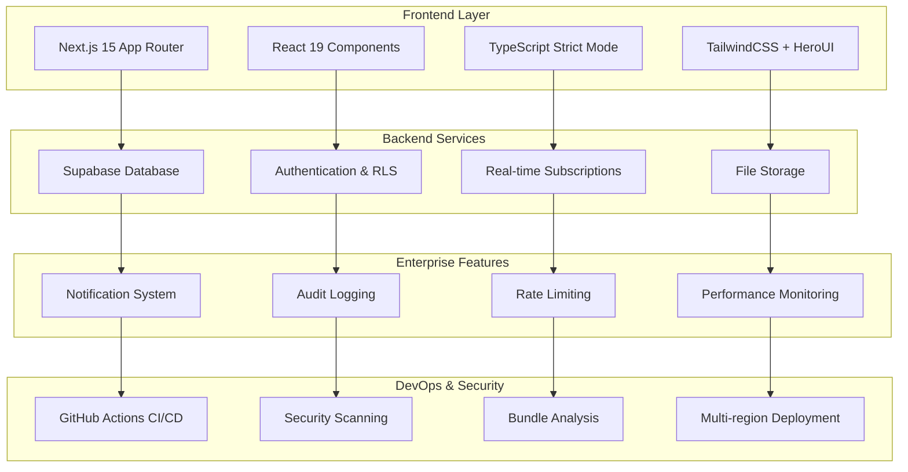

# 🌱 Green Hydrogen Platform - Enterprise Edition

[](https://github.com/NiranjanS20/Green-Hydrogen-Platform-Test/actions)
[](https://github.com/NiranjanS20/Green-Hydrogen-Platform-Test/actions)
[](https://opensource.org/licenses/MIT)
[](https://www.typescriptlang.org/)
[](https://nextjs.org/)
[](https://supabase.com/)

> **Enterprise-ready hydrogen supply chain management platform with advanced analytics, real-time monitoring, and comprehensive automation.**

---

## 🚀 **What's New in Enterprise Edition v2.0**

### 🔥 **Major Enhancements**
- **🔔 Advanced Notification System** - Real-time alerts with customizable preferences
- **📊 Enhanced Analytics & KPIs** - Industry benchmarking and performance tracking
- **🛡️ Enterprise Security** - Comprehensive audit logging and rate limiting
- **🧪 Demo Mode** - Stakeholder demonstrations with controlled environments
- **⚡ Performance Optimization** - Bundle analysis and code splitting
- **🔄 CI/CD Pipeline** - Automated testing, security scanning, and deployment
- **📱 Accessibility Compliance** - WCAG 2.1 AA standards with screen reader support
- **🌍 Multi-region Support** - Failover capabilities and global deployment
- **📈 Advanced Simulations** - Scenario modeling with market volatility

---

## 📋 **Table of Contents**

- [🌟 Features Overview](#-features-overview)
- [🏗️ Architecture](#️-architecture)
- [🚀 Quick Start](#-quick-start)
- [🔧 Configuration](#-configuration)
- [📊 Enterprise Features](#-enterprise-features)
- [🛡️ Security](#️-security)
- [🧪 Testing](#-testing)
- [📈 Performance](#-performance)
- [🚀 Deployment](#-deployment)
- [📚 API Documentation](#-api-documentation)
- [🤝 Contributing](#-contributing)
- [📄 License](#-license)

---

## 🌟 **Features Overview**

### **Core Supply Chain Management**
| Module | Features | Status |
|--------|----------|--------|
| **🏭 Production** | Electrolyzer management, efficiency tracking, LCOH calculations | ✅ Complete |
| **🗄️ Storage** | Tank monitoring, safety systems, capacity optimization | ✅ Complete |
| **🚛 Transportation** | Route optimization, vehicle tracking, delivery management | ✅ Complete |
| **⚡ Renewable Energy** | Solar/wind/hydro integration, weather dependency | ✅ Complete |
| **📊 Analytics** | Real-time dashboards, trend analysis, forecasting | ✅ Complete |

### **Enterprise Features**
| Feature | Description | Status |
|---------|-------------|--------|
| **🔔 Notifications** | Real-time alerts, email/SMS integration, custom preferences | ✅ Complete |
| **📈 KPI Tracking** | Industry benchmarks, performance metrics, trend analysis | ✅ Complete |
| **🛡️ Security** | Audit logs, rate limiting, vulnerability scanning | ✅ Complete |
| **🧪 Demo Mode** | Controlled environments for stakeholder presentations | ✅ Complete |
| **📱 Accessibility** | WCAG 2.1 AA compliance, screen reader support | ✅ Complete |
| **🔄 CI/CD** | Automated testing, security scans, deployment pipelines | ✅ Complete |
| **🌍 Multi-region** | Global deployment, failover capabilities | ✅ Complete |
| **📊 Advanced Analytics** | Predictive modeling, scenario analysis | ✅ Complete |

---

## 🏗️ **Architecture**



---

## 🚀 **Quick Start**

### **Prerequisites**
- **Node.js** 18+ with npm/yarn
- **Supabase** account and project
- **Git** for version control

### **1. Installation**
```bash
# Clone the repository
git clone https://github.com/NiranjanS20/Green-Hydrogen-Platform-Test.git
cd Green-Hydrogen-Platform-Test

# Install dependencies
npm install --legacy-peer-deps

# Install development tools
npm install -g @supabase/cli
```

### **2. Environment Setup**
```bash
# Copy environment template
cp .env.example .env.local

# Configure your environment variables
NEXT_PUBLIC_SUPABASE_URL=your_supabase_project_url
NEXT_PUBLIC_SUPABASE_ANON_KEY=your_supabase_anon_key
NEXT_PUBLIC_SUPABASE_STORAGE_BUCKET=hydrogen-data
```

### **3. Database Setup**
```bash
# Initialize Supabase (if using local development)
supabase init
supabase start

# Run database migrations
supabase db reset

# Or manually execute SQL files in Supabase Dashboard:
# 1. database-setup.sql (core schema)
# 2. database-admin-approval-system.sql (admin features)
# 3. database-enterprise-enhancements.sql (enterprise features)
```

### **4. Development Server**
```bash
# Start development server
npm run dev

# Run with bundle analysis
ANALYZE=true npm run build

# Run tests
npm test

# Run type checking
npm run type-check
```

---

## 🔧 **Configuration**

### **Environment Variables**
| Variable | Description | Required | Default |
|----------|-------------|----------|---------|
| `NEXT_PUBLIC_SUPABASE_URL` | Supabase project URL | ✅ | - |
| `NEXT_PUBLIC_SUPABASE_ANON_KEY` | Supabase anonymous key | ✅ | - |
| `NEXT_PUBLIC_SUPABASE_STORAGE_BUCKET` | Storage bucket name | ✅ | `hydrogen-data` |
| `SUPABASE_SERVICE_ROLE_KEY` | Service role key (server-side) | ⚠️ | - |
| `NEXTAUTH_SECRET` | Authentication secret | ⚠️ | - |
| `SMTP_HOST` | Email server host | ❌ | - |
| `SMTP_USER` | Email server username | ❌ | - |
| `SMTP_PASS` | Email server password | ❌ | - |

### **Feature Flags**
```typescript
// lib/config.ts
export const FEATURE_FLAGS = {
  NOTIFICATIONS: true,
  DEMO_MODE: true,
  ADVANCED_ANALYTICS: true,
  MULTI_REGION: false,
  BETA_FEATURES: false,
};
```

---

## 📊 **Enterprise Features**

### **🔔 Notification System**
- **Real-time Alerts**: Production issues, storage levels, transport delays
- **Multi-channel Delivery**: Email, SMS, push notifications, in-app
- **Custom Preferences**: User-configurable alert types and thresholds
- **Smart Routing**: Priority-based notification delivery

```typescript
// Example: Creating a notification
await createNotification({
  user_id: 'user-123',
  title: 'Storage Tank Critical',
  message: 'Tank A has reached 95% capacity',
  type: 'warning',
  priority: 'high',
  action_url: '/storage/tank-a'
});
```

### **📈 KPI & Benchmarking**
- **Industry Benchmarks**: Compare against industry standards
- **Performance Metrics**: Efficiency, cost, environmental impact
- **Trend Analysis**: Historical data and predictive modeling
- **Custom KPIs**: Define organization-specific metrics

### **🛡️ Security & Compliance**
- **Audit Logging**: Complete trail of all system actions
- **Rate Limiting**: API protection and abuse prevention
- **Security Scanning**: Automated vulnerability detection
- **Data Encryption**: End-to-end encryption for sensitive data

### **🧪 Demo Mode**
- **Controlled Environment**: Safe demonstration space
- **Sample Data**: Realistic datasets for presentations
- **Feature Restrictions**: Limit actions in demo mode
- **Auto-reset**: Scheduled data cleanup

---

## 🛡️ **Security**

### **Authentication & Authorization**
- **Multi-factor Authentication**: TOTP and SMS-based 2FA
- **Role-based Access Control**: Admin, Manager, Operator, Viewer roles
- **Row Level Security**: Database-level data isolation
- **Session Management**: Secure token handling and rotation

### **Data Protection**
- **Encryption at Rest**: AES-256 database encryption
- **Encryption in Transit**: TLS 1.3 for all communications
- **Data Anonymization**: PII protection and GDPR compliance
- **Backup Security**: Encrypted backups with retention policies

### **Security Monitoring**
```bash
# Run security audit
npm audit --audit-level=moderate

# Dependency vulnerability scan
npm run security:scan

# OWASP dependency check
npm run security:owasp
```

---

## 🧪 **Testing**

### **Test Coverage**
- **Unit Tests**: Component and function testing with Jest
- **Integration Tests**: API and database interaction testing
- **E2E Tests**: Full user workflow testing with Playwright
- **Performance Tests**: Load testing and benchmarking

### **Running Tests**
```bash
# Run all tests
npm test

# Run with coverage
npm run test:coverage

# Run specific test suite
npm test -- --testNamePattern="Notification"

# Run E2E tests
npm run test:e2e

# Run performance tests
npm run test:performance
```

### **Test Configuration**
```javascript
// jest.config.js
module.exports = {
  testEnvironment: 'jsdom',
  setupFilesAfterEnv: ['<rootDir>/jest.setup.js'],
  coverageThreshold: {
    global: {
      branches: 70,
      functions: 70,
      lines: 70,
      statements: 70,
    },
  },
};
```

---

## 📈 **Performance**

### **Optimization Features**
- **Code Splitting**: Dynamic imports and route-based splitting
- **Bundle Analysis**: Webpack bundle analyzer integration
- **Image Optimization**: Next.js Image component with WebP/AVIF
- **Caching Strategy**: Static generation and incremental regeneration

### **Performance Monitoring**
```typescript
// Performance metrics collection
export function trackPerformance(metric: string, value: number) {
  // Send to analytics service
  analytics.track('performance_metric', {
    metric_name: metric,
    value,
    timestamp: Date.now(),
    user_id: getCurrentUserId(),
  });
}
```

### **Bundle Analysis**
```bash
# Analyze bundle size
ANALYZE=true npm run build

# Check bundle composition
npm run analyze

# Performance audit
npm run lighthouse
```

---

## 🚀 **Deployment**

### **Vercel Deployment (Recommended)**
```bash
# Install Vercel CLI
npm i -g vercel

# Deploy to staging
vercel

# Deploy to production
vercel --prod
```

### **Docker Deployment**
```dockerfile
# Dockerfile
FROM node:18-alpine AS builder
WORKDIR /app
COPY package*.json ./
RUN npm ci --legacy-peer-deps
COPY . .
RUN npm run build

FROM node:18-alpine AS runner
WORKDIR /app
COPY --from=builder /app/.next/standalone ./
COPY --from=builder /app/.next/static ./.next/static
EXPOSE 3000
CMD ["node", "server.js"]
```

### **Environment-specific Configurations**
```yaml
# .github/workflows/deploy.yml
name: Deploy to Production
on:
  push:
    branches: [main]
jobs:
  deploy:
    runs-on: ubuntu-latest
    steps:
      - uses: actions/checkout@v4
      - name: Deploy to Vercel
        uses: amondnet/vercel-action@v25
        with:
          vercel-token: ${{ secrets.VERCEL_TOKEN }}
          vercel-org-id: ${{ secrets.ORG_ID }}
          vercel-project-id: ${{ secrets.PROJECT_ID }}
          vercel-args: '--prod'
```

---

## 📚 **API Documentation**

### **Core Endpoints**
| Endpoint | Method | Description | Auth Required |
|----------|--------|-------------|---------------|
| `/api/production` | GET, POST, PUT, DELETE | Production facility management | ✅ |
| `/api/storage` | GET, POST, PUT, DELETE | Storage facility management | ✅ |
| `/api/transportation` | GET, POST, PATCH, DELETE | Transport route management | ✅ |
| `/api/analytics` | GET | Analytics and KPI data | ✅ |
| `/api/notifications` | GET, POST, PATCH | Notification management | ✅ |
| `/api/admin` | GET, POST, PUT, DELETE | Admin operations | 🔒 Admin |

### **Enterprise Endpoints**
| Endpoint | Method | Description | Auth Required |
|----------|--------|-------------|---------------|
| `/api/audit-logs` | GET | Audit trail access | 🔒 Admin |
| `/api/kpis` | GET, POST, PUT | KPI management | ✅ |
| `/api/benchmarks` | GET | Industry benchmarks | ✅ |
| `/api/demo` | POST, DELETE | Demo session management | 🔒 Admin |
| `/api/export` | POST | Data export functionality | ✅ |
| `/api/health` | GET | System health check | ❌ |

### **Rate Limits**
| Endpoint Category | Limit | Window | User-specific |
|-------------------|-------|--------|---------------|
| Production APIs | 10 req/min | 60s | ✅ |
| Analytics APIs | 30 req/min | 60s | ✅ |
| File Upload | 5 req/5min | 300s | ✅ |
| Admin APIs | 20 req/min | 60s | ✅ |

---

## 🤝 **Contributing**

### **Development Workflow**
1. **Fork** the repository
2. **Create** a feature branch (`git checkout -b feature/amazing-feature`)
3. **Commit** your changes (`git commit -m 'Add amazing feature'`)
4. **Push** to the branch (`git push origin feature/amazing-feature`)
5. **Open** a Pull Request

### **Code Standards**
- **TypeScript**: Strict mode enabled
- **ESLint**: Next.js recommended configuration
- **Prettier**: Consistent code formatting
- **Conventional Commits**: Semantic commit messages

### **Pull Request Guidelines**
- ✅ All tests pass
- ✅ Code coverage maintained
- ✅ Security scan passes
- ✅ Documentation updated
- ✅ Breaking changes documented

---

## 📊 **System Requirements**

### **Minimum Requirements**
- **Node.js**: 18.0.0+
- **RAM**: 4GB
- **Storage**: 10GB
- **Network**: Broadband internet

### **Recommended Requirements**
- **Node.js**: 20.0.0+
- **RAM**: 8GB+
- **Storage**: 50GB SSD
- **Network**: High-speed internet
- **OS**: Linux/macOS/Windows 10+

---

## 🔍 **Troubleshooting**

### **Common Issues**

#### **Build Errors**
```bash
# Clear Next.js cache
rm -rf .next

# Reinstall dependencies
rm -rf node_modules package-lock.json
npm install --legacy-peer-deps

# Type check
npm run type-check
```

#### **Database Issues**
```bash
# Reset Supabase database
supabase db reset

# Check connection
supabase status

# View logs
supabase logs
```

#### **Performance Issues**
```bash
# Analyze bundle
ANALYZE=true npm run build

# Check memory usage
node --max-old-space-size=4096 node_modules/.bin/next build

# Profile performance
npm run lighthouse
```

---

## 📈 **Roadmap**

### **Q1 2024**
- [ ] **Mobile App**: React Native companion app
- [ ] **AI Integration**: Machine learning predictions
- [ ] **Advanced Reporting**: Custom report builder
- [ ] **API v2**: GraphQL endpoint

### **Q2 2024**
- [ ] **IoT Integration**: Sensor data ingestion
- [ ] **Blockchain**: Supply chain traceability
- [ ] **Advanced Simulation**: Digital twin modeling
- [ ] **Multi-tenant**: SaaS deployment model

---

## 📄 **License**

This project is licensed under the **MIT License** - see the [LICENSE](LICENSE) file for details.

---

## 🙏 **Acknowledgments**

- **Next.js Team** for the amazing framework
- **Supabase Team** for the backend infrastructure
- **HeroUI Team** for the component library
- **Open Source Community** for the incredible tools and libraries

---

## 📞 **Support**

- **Documentation**: [GitHub Wiki](https://github.com/NiranjanS20/Green-Hydrogen-Platform-Test/wiki)
- **Issues**: [GitHub Issues](https://github.com/NiranjanS20/Green-Hydrogen-Platform-Test/issues)
- **Discussions**: [GitHub Discussions](https://github.com/NiranjanS20/Green-Hydrogen-Platform-Test/discussions)
- **Email**: support@greenhydrogenplatform.com

---

<div align="center">

**🌱 Built with ❤️ for a sustainable future**

[](https://github.com/NiranjanS20/Green-Hydrogen-Platform-Test/stargazers)
[](https://github.com/NiranjanS20/Green-Hydrogen-Platform-Test/network/members)
[](https://github.com/NiranjanS20/Green-Hydrogen-Platform-Test/issues)

</div>
